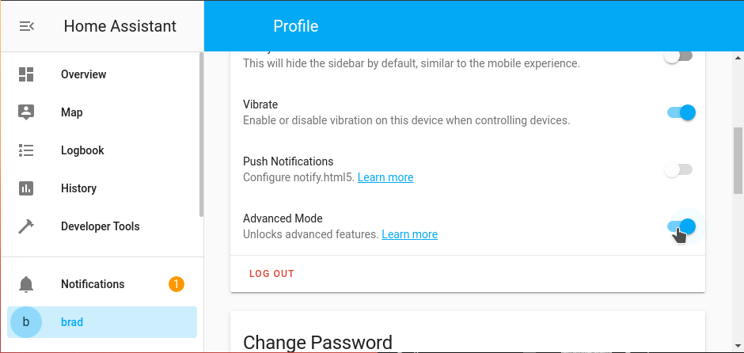

# Custom Strategies Development

> Introduced in Home Assistant 2021.5.

## Table of Contents

- [Introduction](#introduction)
- [Dashboard Strategies](#dashboard-strategies)
- [View Strategies](#view-strategies)
- [Full Example](#full-example)
- [Registering Resources](#registering-resources)

## Introduction

Strategies are JavaScript functions that generate dashboard configurations. When a user has not created a dashboard configuration yet, an auto-generated dashboard is shown. That configuration is generated using a built-in strategy.

It's possible for developers to create their own strategies to generate dashboards. Strategies can use all of Home Assistant's data and the user's dashboard configuration to create something new.

A strategy can be applied to the whole configuration or to a specific view.

Strategies are defined as a custom element in a JavaScript file, and included via dashboard resources. Home Assistant will call static functions on the class instead of rendering it as a custom element.

## Dashboard strategies​
A dashboard strategy is responsible for generating a full dashboard configuration. This can either be from scratch, or based on an existing dashboard configuration that is passed in.

Two parameters are passed to the strategy:

| Key | Description |
| --- | --- |
| config | Dashboard strategy configuration. |
| hass | The Home Assistant object. |

```javascript
class StrategyDemo {
  static async generate(config, hass) {
    return {
      title: "Generated Dashboard",
      views: [
        {
          "cards": [
            {
              "type": "markdown",
              "content": `Generated at ${(new Date).toLocaleString()}`
            }
          ]
        }
      ]
    };
  }
}

customElements.define("ll-strategy-my-demo", StrategyDemo);
```

Use the following dashboard configuration to use this strategy:

```yaml
strategy:
  type: custom:my-demo
```

## View Strategies
A view strategy is responsible for generating the configuration of a specific dashboard view. The strategy is invoked when the user opens the specific view.

Two parameters are passed to the strategy:

| Key	| Description |
| config	| View strategy configuration. |
| hass	| The Home Assistant object. |

```
class StrategyDemo {
  static async generate(config, hass) {
    return {
      "cards": [
        {
          "type": "markdown",
          "content": `Generated at ${(new Date).toLocaleString()}`
        }
      ]
    };
  }
}

customElements.define("ll-strategy-my-demo", StrategyDemo);
```


Use the following dashboard configuration to use this strategy:

```
views:
- strategy:
    type: custom:my-demo
```


## Full example​

It's recommended for a dashboard strategy to leave as much work to be done to the view strategies. That way the dashboard will show up for the user as fast as possible. This can be done by having the dashboard generate a configuration with views that rely on its own strategy.

Below example will create a view per area, with each view showing all entities in that area in a grid.

```
class StrategyDashboardDemo {
  static async generate(config, hass) {
    // Query all data we need. We will make it available to views by storing it in strategy options.
    const [areas, devices, entities] = await Promise.all([
      hass.callWS({ type: "config/area_registry/list" }),
      hass.callWS({ type: "config/device_registry/list" }),
      hass.callWS({ type: "config/entity_registry/list" }),
    ]);

    // Each view is based on a strategy so we delay rendering until it's opened
    return {
      views: areas.map((area) => ({
        strategy: {
          type: "custom:my-demo",
          area, 
          devices, 
          entities,
        },
        title: area.name,
        path: area.area_id,
      })),
    };
  }
}
```

```
class StrategyViewDemo {
  static async generate(config, hass) {
    const { area, devices, entities } = config;

    const areaDevices = new Set();

    // Find all devices linked to this area
    for (const device of devices) {
      if (device.area_id === area.area_id) {
        areaDevices.add(device.id);
      }
    }

    const cards = [];

    // Find all entities directly linked to this area
    // or linked to a device linked to this area.
    for (const entity of entities) {
      if (
        entity.area_id
          ? entity.area_id === area.area_id
          : areaDevices.has(entity.device_id)
      ) {
        cards.push({
          type: "button",
          entity: entity.entity_id,
        });
      }
    }

    return {
      cards: [
        {
          type: "grid",
          cards,
        },
      ],
    };
  }
}

customElements.define("ll-strategy-dashboard-my-demo", StrategyDashboardDemo);
customElements.define("ll-strategy-view-my-demo", StrategyViewDemo);
```

Use the following dashboard configuration to use this strategy:

```yaml
strategy:
  type: custom:my-demo
```

## Registering Resources

If you want to extend the Home Assistant interface with custom cards, strategies or views you need to load external resources.

The first step is to make it accessible for the Home Assistant frontend. This is done by creating a new directory in your config folder called `www`. Create this directory and restart Home Assistant.

Once restarted, you can put files in this directory. Each file will be accessible without authentication via the UI at /local.

The next step is to register these resources with the Home Assistant interface. This is done by navigating to the Resources page by following below link:

https://my.home-assistant.io/redirect/lovelace_dashboards/ [alt text: Open your Home Assistant instance and show your resources.]

> note: This area is only available when the active user's profile has "advanced mode" enabled.



Alternatively, you can also register the resource by adding it to the resources section of lovelace in the configuration:

```yaml
resources:
  - url: /local/<name of the resource>.js
    type: module
```
